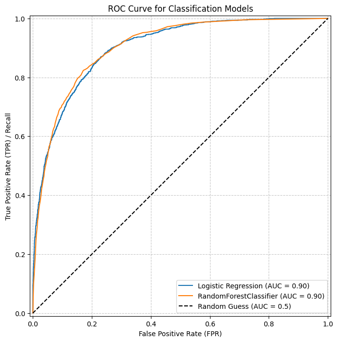

# Individual Income Prediction: Classification Analysis of the Adult Income Dataset

<div align="center">
  
</div>

## Project Description

This project is part of **“Big Data Challenge 4: Classification Challenge”**, focusing on building a classification model to predict whether an individual’s income exceeds **$50,000 per year** based on census data. The project includes stages of Exploratory Data Analysis (EDA), data preprocessing, Machine Learning model training, and model performance evaluation.

## Dataset

The dataset used is the **Adult Income Dataset**, which commonly originates from the **1994 United States Census** data. This dataset contains various demographic and occupational features that may influence an individual’s income level.

### Key Features:

* `age`: Age of the individual.
* `workclass`: Type of employment (e.g., Private, Self-emp-not-inc, State-gov).
* `education`: Education level (e.g., Bachelors, HS-grad, Some-college).
* `education-num`: Numerical representation of education level.
* `marital-status`: Marital status.
* `occupation`: Type of occupation/profession.
* `relationship`: Family relationship (e.g., Husband, Not-in-family, Own-child).
* `race`: Individual’s race.
* `sex`: Gender.
* `capital-gain`: Capital gains.
* `capital-loss`: Capital losses.
* `hours-per-week`: Number of working hours per week.
* `native-country`: Country of origin.

### Target Variable:

* `income`: Income category, classified as `<=50K` or `>50K`.

## Technologies Used

* **Python**
* **Pandas:** For data manipulation and analysis.
* **NumPy:** For numerical computation.
* **Scikit-learn (sklearn):** For data preprocessing (scaling, train-test split), classification models (Logistic Regression, RandomForestClassifier), and evaluation metrics.
* **Matplotlib & Seaborn:** For data visualization.
* **imbalanced-learn (imblearn):** For handling class imbalance (using SMOTE).

## Project Workflow

This project follows a standard Machine Learning workflow:

1. **Dataset Loading & Preview:** Loading data from a `.csv` file and inspecting the first few rows.
2. **Missing Values & Data Type Checking:** Identifying missing values and data types for each column. The dataset was found to be relatively clean with minimal missing values.
3. **Data Preprocessing:**

   * Imputing missing values (although none were found in this dataset, the imputation method was prepared).
   * One-Hot Encoding for categorical variables (`pd.get_dummies()`).
   * Transforming the target variable `income` into binary form (0 for `<=50K` and 1 for `>50K`).
4. **Feature–Target Relationship Visualization:** Creating plots (box plots, bar plots) to understand the relationship between key features (e.g., age, gender, education, working hours) and the target variable `income`.
5. **Train-Test Split & Scaling:**

   * Splitting the dataset into training data (80%) and testing data (20%).
   * Applying `StandardScaler` to numerical columns to standardize feature scales.
6. **Handling Class Imbalance (Balancing):**

   * Analyzing the target class distribution and identifying imbalance (approximately 75% `<=50K` and 25% `>50K`).
   * Applying **SMOTE (Synthetic Minority Over-sampling Technique)** to the training data (`X_train` and `y_train`) to balance the number of samples in both classes.
7. **Training Classification Models:**

   * Training two classification models: **Logistic Regression** and **RandomForestClassifier** using the balanced training data (`X_train_resampled`, `y_train_resampled`).
8. **Model Evaluation:**

   * Evaluating both models on the testing data (`X_test`, `y_test`) using the following metrics: Accuracy, Precision, Recall, F1-Score, Confusion Matrix, and ROC Curve with AUC Score.

## Results & Findings

After preprocessing and model training, both models demonstrated promising performance:

* **Logistic Regression:**

  * Accuracy: `0.8194`
  * Precision (`>50K`): `0.5935`
  * Recall (`>50K`): `0.7982`
  * F1-Score (`>50K`): `0.6808`
  * AUC Score: `0.9015`

* **RandomForestClassifier:**

  * Accuracy: `0.8491`
  * Precision (`>50K`): `0.6742`
  * Recall (`>50K`): `0.7244`
  * F1-Score (`>50K`): `0.6984`
  * AUC Score: `0.9040`

**Evaluation Conclusion:**
Both models show **very strong discriminative ability** between income classes (`AUC > 0.90`). The **RandomForestClassifier slightly outperforms Logistic Regression** in overall accuracy and F1-Score for the minority class (`>50K`), making it the better model choice in this case. This indicates that handling class imbalance using SMOTE successfully helped the models learn from the minority class.

## How to Run the Project

1. **Clone this repository:**

   ```bash
   git clone [YOUR_REPOSITORY_LINK]
   ```
2. **Install dependencies:**

   ```bash
   pip install pandas numpy scikit-learn matplotlib seaborn imbalanced-learn
   ```
3. **Download the dataset:** Ensure that the `data.csv` file (or the relevant dataset file name) is located in the same directory as your notebook/script.
4. **Run the notebook/script:** Open the Jupyter Notebook or Python script containing the project code and run each cell sequentially.

## Future Work

This project can be further improved by:

* **Hyperparameter Tuning:** Optimizing model parameters for better performance.
* **Feature Engineering:** Creating more meaningful features from existing ones.
* **Feature Selection:** Analyzing and selecting the most relevant features to reduce model complexity.
* **Exploring Other Models:** Trying more advanced classification algorithms such as XGBoost, LightGBM, or Support Vector Machines.
* **Outlier Analysis:** Identifying and handling outliers that may affect model performance.

## Contributors

* **Khairunnisa Maharani**
